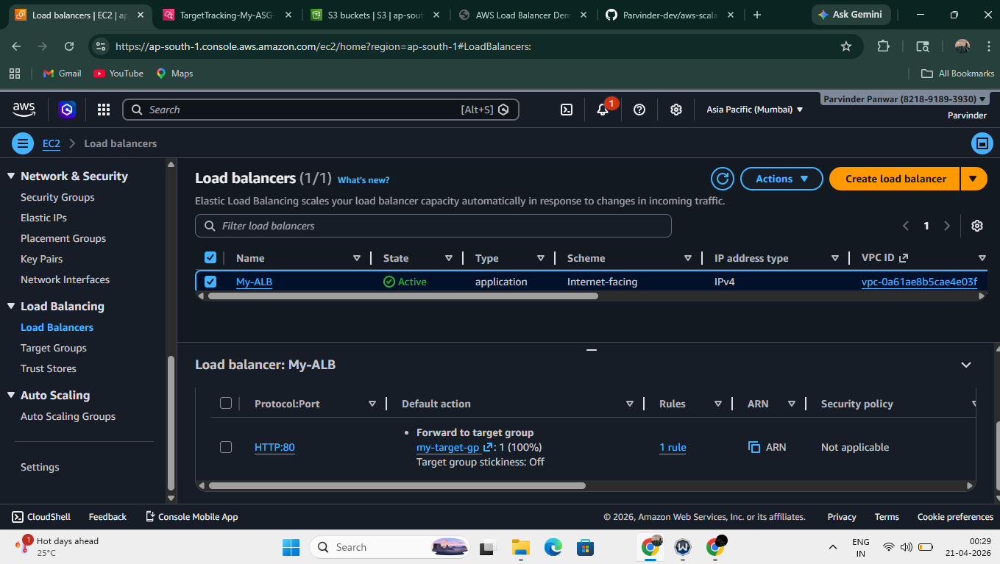
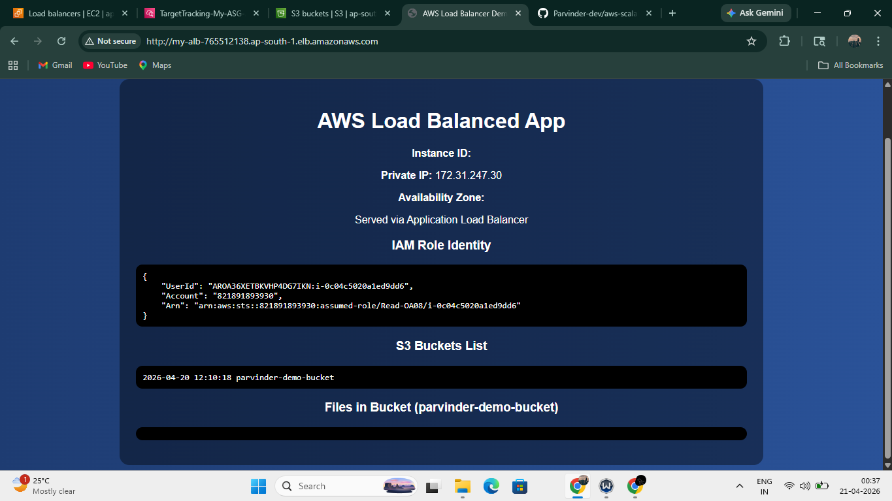
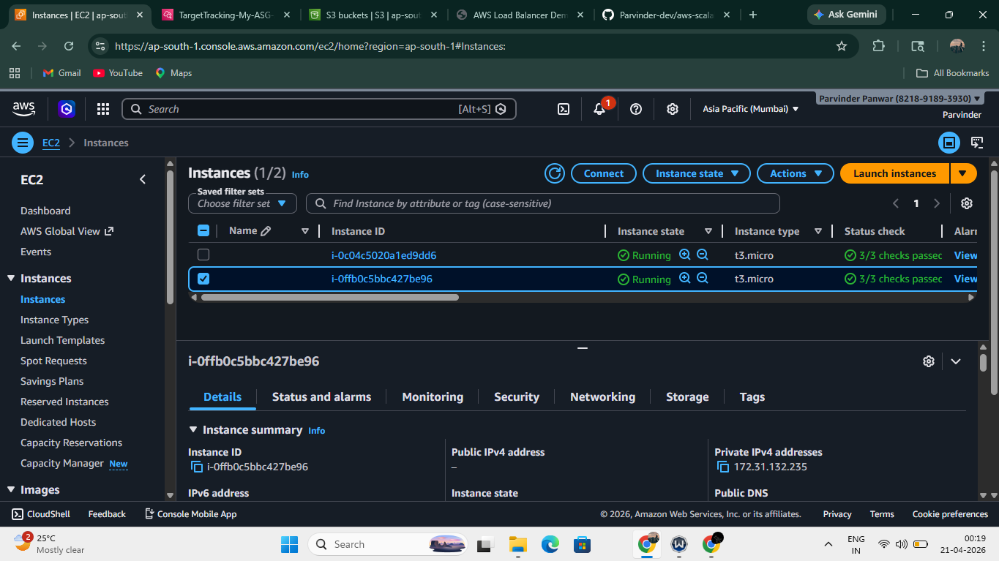
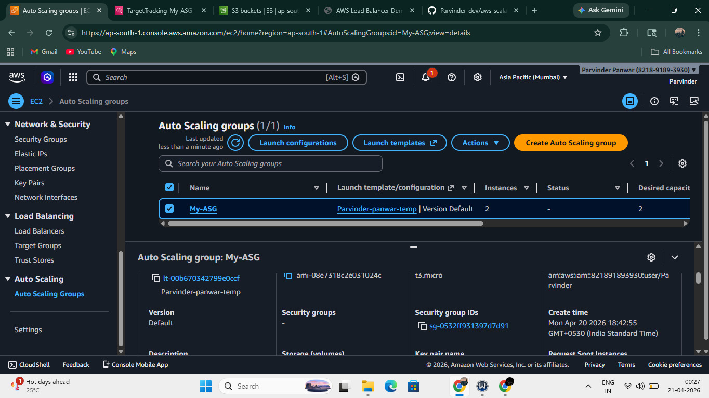
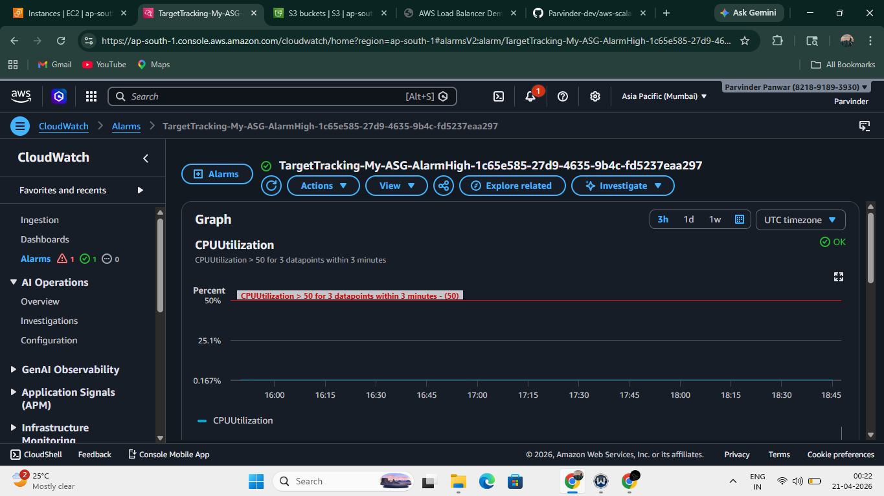
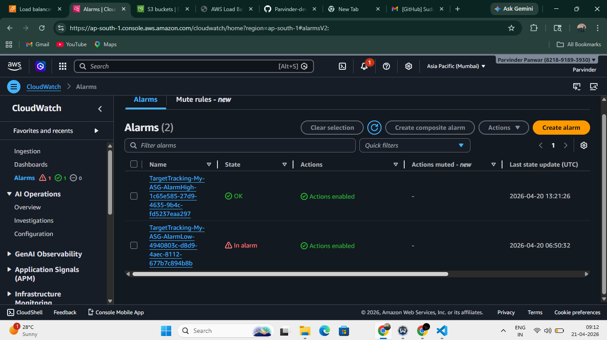

# AWS Scalable Web Infrastructure 🚀

## 📌 Project Overview

Designed and deployed a highly available, secure, and scalable web infrastructure on AWS using Application Load Balancer, Auto Scaling, and CloudWatch monitoring.

---

## 🏗️ Architecture

User → Application Load Balancer → Auto Scaling EC2 (Private Subnets) → NAT Gateway → Internet

---

## ⚙️ Services Used

* Amazon EC2
* VPC (Public & Private Subnets)
* Application Load Balancer (ALB)
* Auto Scaling Group (ASG)
* CloudWatch (Monitoring & Alarms)
* IAM Roles (Secure Access)
* Amazon S3 (Access Validation)

---

## 🔐 Features

* EC2 instances deployed in private subnets for enhanced security
* Load balancing using Application Load Balancer
* Auto scaling based on CPU utilization
* IAM role-based secure access (no hardcoded credentials)
* Real-time monitoring using CloudWatch
* Automated scaling triggered using CloudWatch alarms

---

## 🌐 VPC Configuration

* Custom VPC with public and private subnets
* Internet Gateway attached to public subnet
* NAT Gateway enabling internet access for private instances

---

## 📊 Output

* Application successfully served via ALB DNS
* Traffic distributed across multiple EC2 instances
* Auto scaling triggered automatically based on CPU thresholds
* IAM role validated using AWS STS
* S3 access verified without using access keys

---

## 📸 Screenshots
ALB Setup $ ALB Traffic

### 🔹 EC2 Instances

### 🔹 Auto Scaling

### 🔹 CloudWatch Monitoring & Alarms

## 👨‍💻 Author

**Parvinder Panwar**
